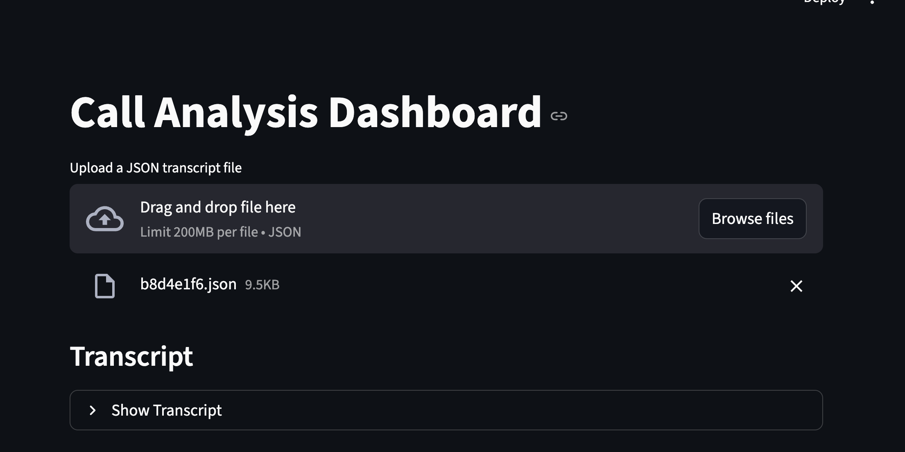
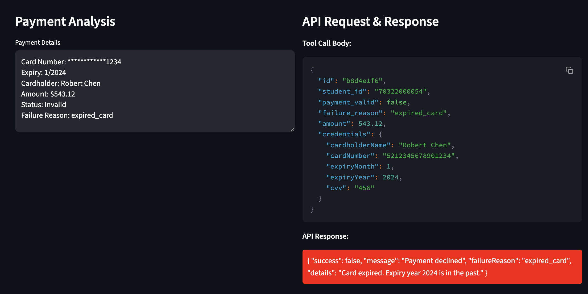
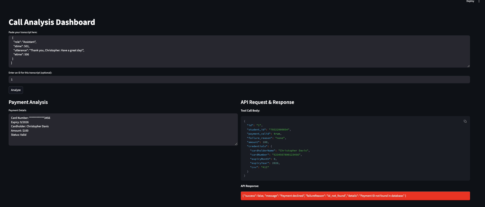

# Call Analysis Dashboard

A Streamlit-based web application for analyzing call transcripts, extracting payment information, and validating payment details. The application uses Groq LLM for natural language processing and integrates with a payment validation API.


##Screenshots

- **Uploading JSON Transcript**:


- **Output**:


- **Pasting JSON Transcript and Output**:



## Features

- **Dual Analysis System**:
  - Task 1: Call transcript analysis for customer intent, sentiment, and agent performance
  - Task 2: Payment information extraction and validation

- **User Interface**:
  - Upload JSON transcripts or paste text directly
  - Interactive dashboard with real-time analysis
  - Color-coded API responses (green for success, red for failure)
  - Expandable transcript view
  - Detailed payment analysis display

## Project Structure

```
├── src/
│   ├── app.py         # Streamlit web application
│   ├── task1.py       # Call analysis implementation
│   └── task2.py       # Payment extraction and validation
├── converted_transcripts/   # Input JSON transcripts
└── analysis_output/        # Analysis results
```

## Requirements

- Python 3.10 or higher
- Required packages:
  - streamlit
  - groq
  - pandas
  - requests

## Installation

1. Clone the repository:
```bash
git clone https://github.com/VikramadityaS11/Prodigal-Assmt.git
cd Prodigal-Assmt
```

2. Create and activate a virtual environment:
```bash
python -m venv .venv
source .venv/bin/activate  # On Windows, use `.venv\Scripts\activate`
```

3. Install dependencies:
```bash
pip install -r requirements.txt
```

## Usage

1. Start the Streamlit application:
```bash
streamlit run src/app.py
```

2. Access the application through your web browser (typically at `http://localhost:8501`)

3. Choose your input method:
   - Upload a JSON transcript file
   - Paste transcript text directly

4. View the analysis results:
   - Payment extraction details
   - API validation response
   - Customer sentiment analysis
   - Agent performance metrics

## API Integration

The application integrates with a payment validation API:
- Endpoint: `https://se-payment-verification-api.service.external.usea2.aws.prodigaltech.com/api/validate-payment`
- Validates payment credentials and provides success/failure responses
- Supports both card and ACH payment methods

## Analysis Components

### Task 1: Call Analysis
- Payment attempt detection
- Customer intent analysis
- Sentiment classification (Satisfied/Neutral/Frustrated/Hostile)
- Agent performance evaluation
- Timestamped event tracking

### Task 2: Payment Processing
- Extracts payment details from transcripts
- Validates payment credentials
- Supports multiple payment methods
- Real-time API validation
- Detailed failure reasoning

## Output Format

### Task 1 Output
```json
{
  "payment_attempted": boolean,
  "customer_intent": boolean,
  "customer_sentiment": {
    "classification": "Satisfied|Neutral|Frustrated|Hostile",
    "description": string
  },
  "agent_performance": string,
  "timestamped_events": [
    {
      "timestamp": "m:ss",
      "event_type": "disclosure|offer_negotiation|payment_setup_attempt|frustration_hostility",
      "description": string
    }
  ]
}
```

### Task 2 Output
```json
{
  "id": string,
  "student_id": string,
  "payment_valid": boolean,
  "failure_reason": string,
  "amount": number,
  "credentials": {
    "cardholderName": string,
    "cardNumber": string,
    "expiryMonth": number,
    "expiryYear": number,
    "cvv": string
  }
}
```

## Security Notes

- Card numbers are masked in the display
- Sensitive data is handled securely
- API responses are validated before display

## License

This project is proprietary and confidential. All rights reserved.
